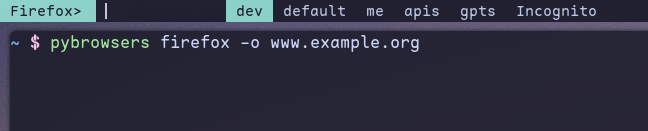
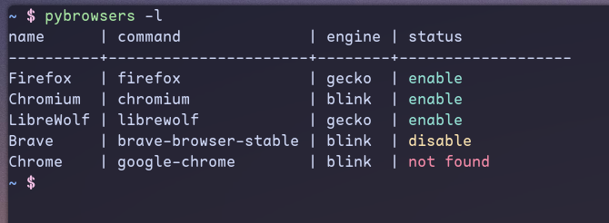

<div align="center">


[](https://github.com/pypa/hatch)
[](https://github.com/charliermarsh/ruff)
[](https://github.com/psf/black)
[](https://github.com/python/mypy)
[](https://spdx.org/licenses/)

</div>

## Profile Launcher

### A Python Script for Effortless Browser Profile Management

### ⭐ About

This Python script simplifies launching browser profiles by automatically retrieving profile information from each browser's config directory. It presents these profiles as launch options, saving time and enhancing workflow, especially for users who frequently switch between multiple profiles.

### 📦 Installation

#### Using `pipx` _(recommended)_

```bash
$ pipx install pybrowsers-profiles
```

> [pipx Homepage](https://github.com/pypa/pipx)

#### Using `pip` install

```bash
# Clone repository
$ git clone "https://github.com/haaag/PyBrowsers"
$ cd PyBrowsers-Profiles

# Create virtual environment & source
$ python -m venv .venv && source .venv/bin/activate

# Install
$ pip install .
```

### ⚡️ Requirements

- [dmenu](https://tools.suckless.org/dmenu/)
- [rofi](https://github.com/davatorium/rofi) _(Optional)_
- [fzf](https://github.com/junegunn/fzf) _(Optional)_

### 🚀 Usage

```bash
$ pybrowsers --help

usage: pybrowsers [-l] [-d DISABLE] [-e ENABLE] [-f] [-t]
                  [-m MENU] [-v] [-V] [browser] [-o URL]

Simple script for manage browser's profiles

options:
    browser             Browser name
    -e, --enable        Enable browser
    -d, --disable       Disable browser
    -l, --list          Show browsers list and status
    -t, --table         Show browsers list with detail
    -m, --menu          Select menu (default: dmenu)
    -f, --found         Browsers found
    -o, --open          Open <URL> in browser
    -V, --version       Show version
    -h, --help          Show help
    -v, --verbose       Verbose mode

locations:
    $HOME/.local/share/pybrowsers
```

#### Use `no flags` to launch menu

```bash
# Open menu with browsers found
$ pybrowsers
```

#### Use flag `browser` for browser's profile

```bash
# Open menu with profiles list
$ pybrowsers firefox
```

#### Use flag `-o, --open` for launching profile with url

<div align="left">
  
</div>

#### Use flag `-m, --menu` option to specify the launcher you want to use _(default: `dmenu`)_

<div align="left">
  
</div>

#### Use flag `-l, --list` for status

<div align="left">
  
</div>
<br>

#### Use flag `-d, --disable` or `-e, --enable`

```bash
# Disable browser (won't appear in `browsers found`)
$ pybrowsers -d firefox

# Enable browser
$ pybrowsers -e firefox
```

### ➕ Add Browser

You can add a browser creating a `JSON` file in `$XDG_DATA_HOME/pybrowsers/` or
`~/.local/share/pybrowsers`

#### Example

```json
{
  "name": "LibreWolf",
  "command": "librewolf",
  "path": "~/.librewolf/profiles.ini",
  "engine": "gecko",
  "enabled": true
}
```

### 🌐 Browsers

- [Firefox](https://www.mozilla.org/firefox/download/thanks/)
- [LibreWolf](https://librewolf.net/)
- [Chromium](https://www.chromium.org/getting-involved/download-chromium/)
- Brave
- Google Chrome

### 🧰 Dependencies

- [PySelector](https://pypi.org/project/pyselector/)

### 🧰 TODO

- [ ] Create `interactive menu` for adding browser data
- [x] Update screenshots
- [x] Add `flag` for open URLs
- [x] Please, use `pathlib.Path`
- [x] BUG: Issue when the profile name contains spaces
- [x] Add support for `json` files _(Prioritize)_
